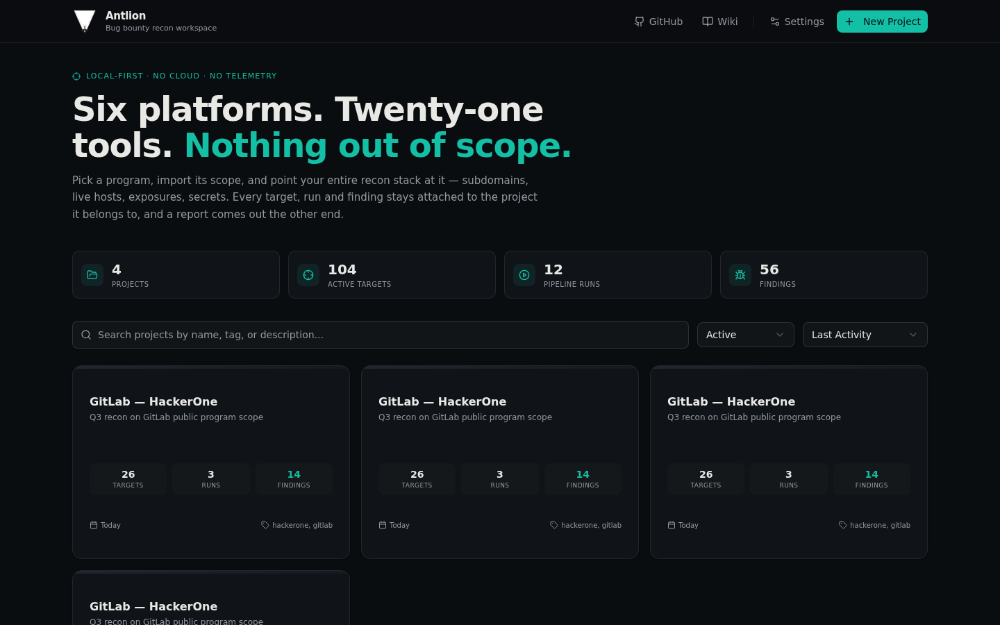
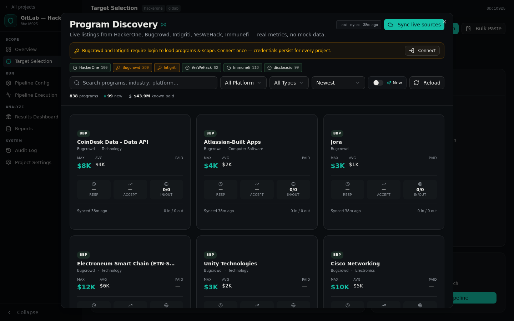
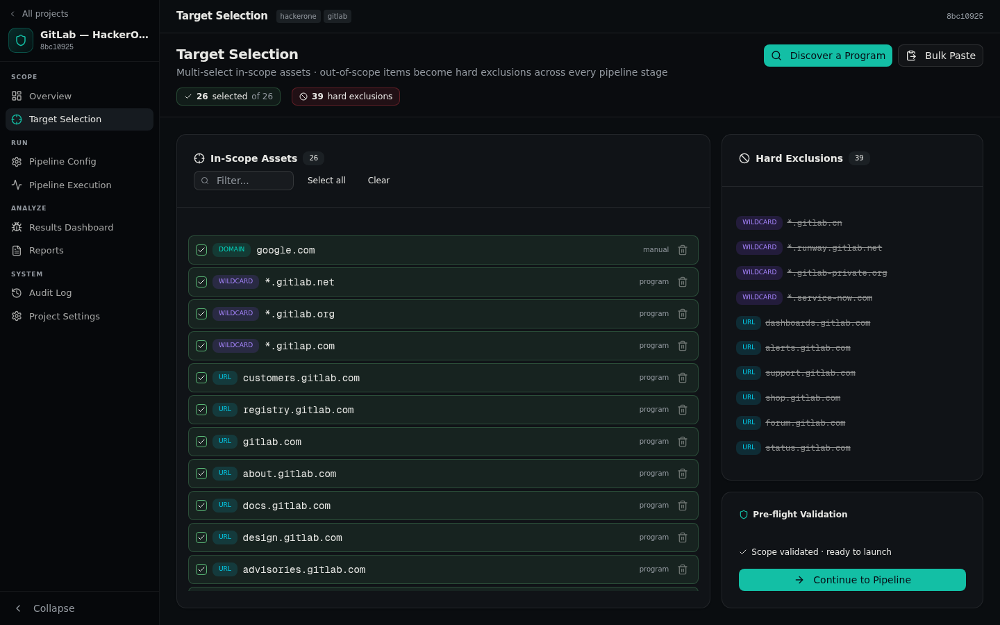
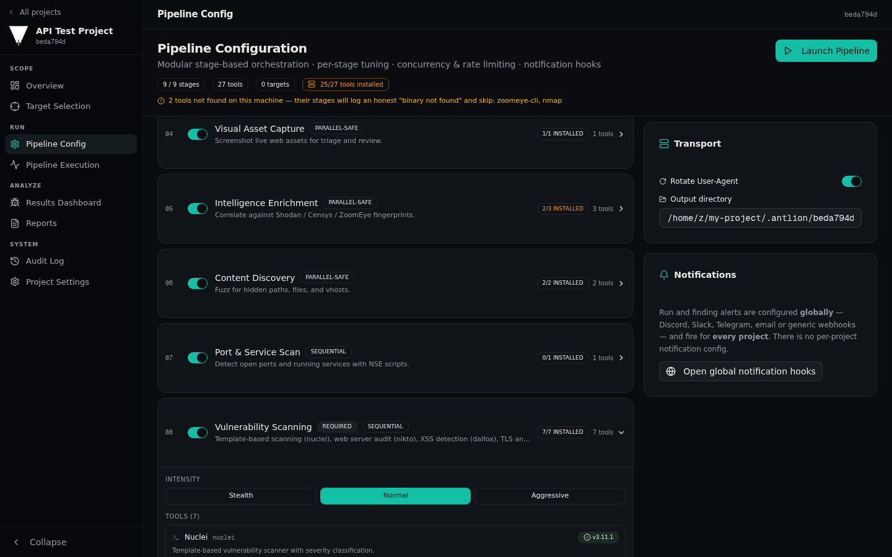
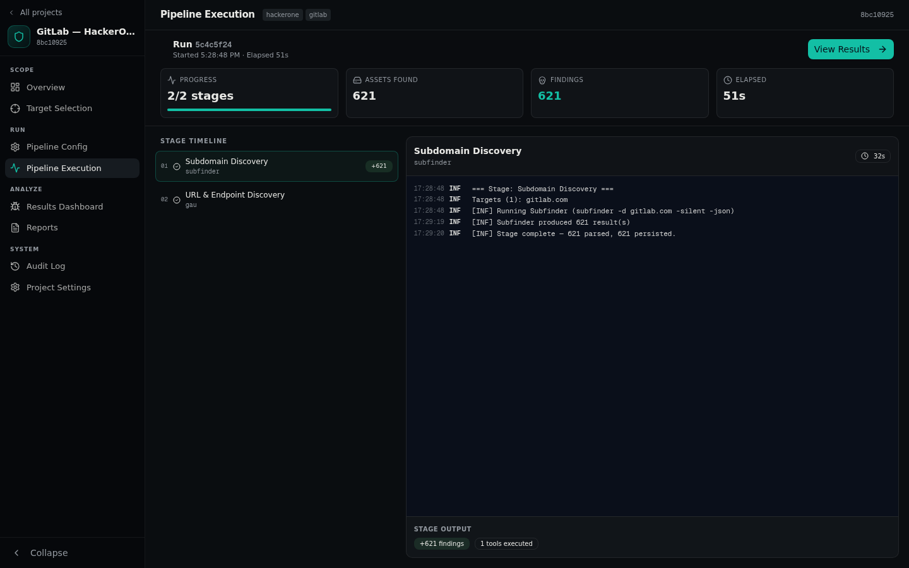
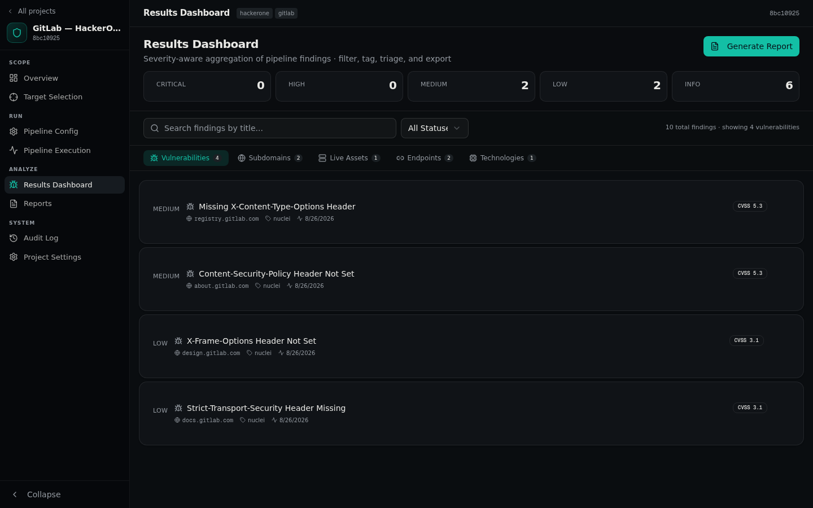
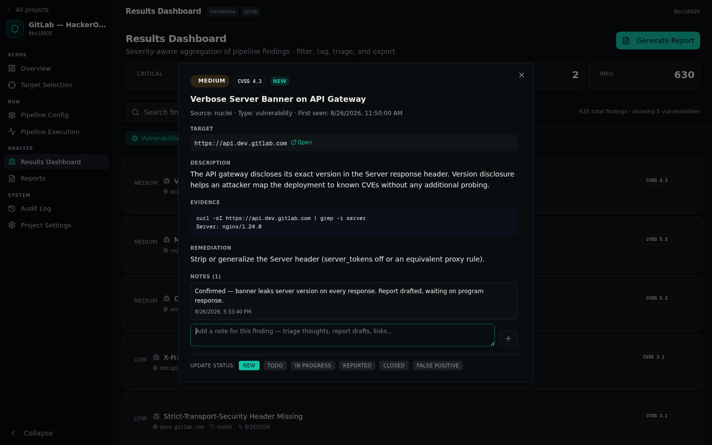
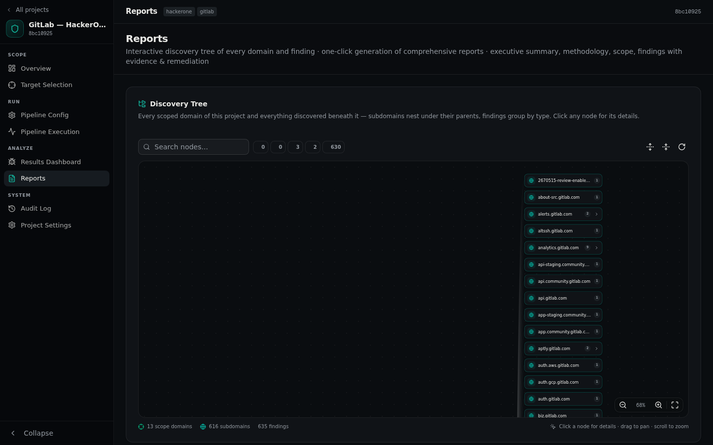
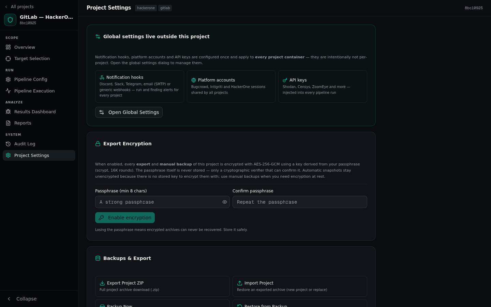
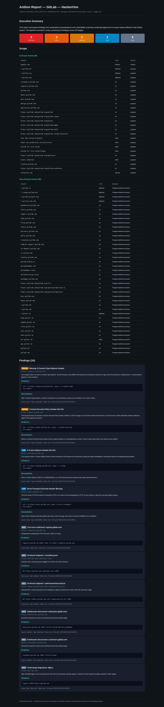

# Antlion

[](https://github.com/antlionsec/Antlion)
[](https://github.com/antlionsec/Antlion/blob/main/LICENSE)
[](https://github.com/antlionsec/Antlion/issues)

A local-first workspace for bug bounty recon. Browse programs on six platforms, import their scope, run a 21-tool pipeline against it, triage the findings, and export a report — all on your machine, in one SQLite database, with no cloud and no telemetry.

> [!IMPORTANT]
> **Disclaimer — read this before anything else.**
>
> Antlion is a personal project, published as-is because I find it useful and thought others might too. **The repository owner is not responsible for how you use this software.** Antlion runs security tools against targets you point it at — that is its entire job. If you point it at systems you are not authorized to test, that is entirely on you, not on me.
>
> Unauthorized scanning and testing is illegal in most jurisdictions and violates the terms of every bug bounty platform. Use it only against programs you are registered with, and only against assets explicitly listed as in-scope. This project is not affiliated with, endorsed by, or connected to any of the platforms it reads public data from. No warranty, no support SLA — it's just a project.

## Why "Antlion"?

The antlion is an insect whose larva digs a cone-shaped pit in the sand and waits at the bottom for other bugs to tumble in. It is, literally, a bug that hunts bugs with an engineered trap. That is a decent description of what this app tries to be: patient, methodical, and built around a single well-constructed hole in the ground. The name stuck.

## What problem does this solve?

Recon on a bug bounty program is usually a terminal-and-notes-file problem. You pull the scope out of a browser tab, paste domains into a text file, run subfinder in one pane, httpx in another, nuclei in a third — and then you manually keep track of what you ran, when, and against what. Three weeks later, when you need to know whether that subdomain was in scope or what tool produced that one finding, you're doing archaeology on your own shell history. Multiply by a handful of active programs and it stops being fun.

Worse, scope is where hunters actually get burned. A stray domain that turned out to be out-of-scope, an over-eager port scan against the wrong IP block, one asset nobody checked against the exclusion list. The damage isn't just a banned account — it's a report you can't file.

Antlion collapses that workflow into one place:

- **Scope is a database, not a text file.** Import a program's in-scope and out-of-scope assets directly from the platform. Exclusions are hard exclusions — tracked separately, per project, and visible everywhere you look at targets.
- **The pipeline is configured, not retyped.** Twenty-one recon tools are wired into ordered stages (subdomain discovery, URL discovery, probing, screenshots, vulnerability scanning, content discovery, port scanning, secrets, OSINT) with per-tool arguments you can tune, live progress, and run controls that actually control the underlying processes.
- **Every run leaves a record.** Each project keeps its own targets, runs, findings, and reports — isolated from your other projects — in a local SQLite database. What was scanned, when, with what, and what came out.
- **Findings become reports without copy-paste.** Triage the findings dashboard, then export a self-contained HTML report (or Markdown, JSON, plain text) with an executive summary, evidence, remediation, and the full scope appendix.

## Screenshots

**The dashboard — projects, live stats, and the discovery entry point**



**Program discovery — live programs from six platforms with bounty and response metrics**



**Target selection — imported scope with hard exclusions enforced per project**



**Pipeline configuration — nine stages, twenty-one tools, per-tool arguments, tool availability detected on your machine**



**Pipeline execution — live stage-by-stage progress with per-tool output and real Pause / Resume / Cancel controls (cancellation kills the in-flight tool process)**



**Results dashboard — findings by severity and type, triage workflow, per-finding notes**



**Finding detail — evidence, remediation, raw tool output and pinned notes**



**Discovery tree — every scope domain and finding as an interactive graph; click any node for its details**



**Project settings — export encryption, real backups and a working danger zone**



**Generated HTML report — self-contained, shareable, generated from project data**



The app ships with a dark and a light theme (it follows your system preference) and works from phone-width screens up to desktop.

## What's inside

| Area | What it actually does |
|---|---|
| Program discovery | Live listings from HackerOne, Bugcrowd, Intigriti, YesWeHack, Immunefi, and the disclose.io registry — with bounty ranges, total paid, average response time, and acceptance rate where the platform exposes it |
| Scope import | One click imports a program's in-scope assets *and* its out-of-scope exclusions into the project |
| Pipeline | 9 stages, 21 tools, per-tool arguments, concurrency and proxy settings — and **real run controls**: Pause waits between tools, Resume continues, Cancel kills the in-flight subprocess and finalizes the run honestly (current stage `cancelled`, remaining stages `skipped`) |
| Tool detection | The app probes your actual `$PATH` at startup and tells you which of the 21 tools are installed, with versions — no fake status lights |
| Findings | Parsed per-tool output with severity, evidence, remediation, CVSS, tags, a triage status workflow (new → todo → in-progress → reported → closed) — and **pinnable notes per finding** for triage thoughts and report drafts |
| Discovery tree | Interactive tree graph in every project's Reports view: scope domains branch into nested subdomains, findings group by type, edges are severity-colored — pan, zoom, search, filter, and click any node for a detail popup |
| Reporting | HTML, Markdown, JSON, and plain-text exports with executive summary, evidence, remediation, and scope appendix |
| Backups & export | Real ZIP archives (PKZIP/DEFLATE written in-process) of the whole project — targets, findings, notes, runs. Manual snapshots, downloads, imports (as new project or replace), restore-from-record, and **optional AES-256-GCM encryption** with a scrypt-derived key (only a verifier is stored, never the passphrase). Automatic daily snapshots with configurable retention |
| Notifications | Global hooks (Discord, Slack, Telegram, email over SMTP, generic JSON) for run completed / failed and new findings — configured once, firing for every project |
| Global settings | Notification hooks, platform accounts, and API keys are workspace-level: set them once on the landing page and every project container uses them. Per-project settings stay project-scoped (export encryption, backups, danger zone) |
| Project lifecycle | Archive, soft-delete to trash (with restore), permanent delete, and duplication that copies targets and exclusions — every state reachable from the dashboard |
| Data ownership | Everything in one local SQLite file. No accounts, no cloud sync, no telemetry. Delete the file and it's gone |

## Installation

**Prerequisites:** Node.js 20+ (or Bun), and a Linux/macOS/WSL machine. The web app itself runs anywhere Node runs; the pipeline tools are detected from your `PATH` at runtime.

```bash
git clone <repository-url> antlion
cd antlion

npm install              # or: bun install

cp .env.example .env     # SQLite database location
npx prisma generate
npx prisma db push       # creates the database file

npm run dev              # http://localhost:3000
```

### Installing the 21 pipeline tools (optional but recommended)

The app runs fine without them — it will honestly show `0/21 tools installed` and let you configure everything — but the pipeline only executes tools that exist on your machine.

On Linux, the bundled installer handles package-name differences across distros (Debian/Ubuntu, Arch, Fedora, openSUSE, Alpine, Void, Gentoo), installs the Go and Python toolchains, builds the Go tools, clones SecLists, writes a resolver list, and downloads nuclei templates:

```bash
sudo bash scripts/install-tools.sh
```

It is idempotent — re-running it only fixes what's missing — and it logs to `/tmp/antlion-install.log` with a FOUND/MISSING summary at the end. On macOS, install the tools yourself (`brew install subfinder nuclei httpx ...`); the app detects whatever it finds on your `PATH` (Global Settings → Tools → *Rescan*).

### API keys (optional)

Shodan, Censys, and ZoomEye stages need their API keys. Enter them under **Settings** (gear button on the landing page) → *API Keys*; they're stored in the local database and injected into the tool environment of every pipeline run, in every project — they never leave your machine.

### Notification hooks (optional)

Want a ping when a run finishes or a critical finding lands? **Settings** → *Notifications* accepts Discord, Slack, and Telegram webhooks, any generic JSON endpoint, and **email over SMTP** (Gmail app password, Mailgun, self-hosted — host, port, encryption, credentials, recipients). Hooks are global — configure once and they fire for every project — and each hook picks its own events (run completed, run failed, new findings) and its own minimum severity. Delivery is best-effort: a failing hook never breaks a pipeline run. SMTP credentials are stored in the local database, exactly like Telegram bot tokens.

## Quick start

1. **Create a project.** Name it after the program you're hunting (`Acme Corp — Q3`, whatever). Everything downstream — targets, runs, findings, reports — lives inside this project.
2. **Discover a program.** Hit *Discover a Program*, search across the six platforms, and open a program to see its scope, bounty metrics, and response stats. *Import to this project* pulls the in-scope assets and out-of-scope exclusions in.
3. **Check your targets.** The Target Selection view shows what's in and what's hard-excluded. Remove anything you don't want touched.
4. **Configure the pipeline.** Pipeline Config shows the nine stages and which tools on your machine are available for each. Tune per-tool arguments if you care, leave defaults if you don't.
5. **Run it.** Watch stages complete in order with live per-tool output. Pause holds the run between tools, Resume continues it, and Cancel terminates the running tool process immediately and records the run as cancelled — no zombie processes, no fake "cancelled" labels on a run that's still scanning.
6. **Triage and report.** Review findings by severity, mark statuses as you work them, keep notes on individual findings, then generate a report from the Reports view.
7. **Back it up.** Project Settings → Backups & Export: download a ZIP of the whole project, snapshot it to `db/backups/`, or turn on automatic daily snapshots. Set a passphrase first if you want archives encrypted (AES-256-GCM). Import restores an archive as a new project or over the current one.

## The toolchain

| Stage | Tools |
|---|---|
| Subdomain discovery | `subfinder`, `amass`, `assetfinder`, `shuffledns`, `dnsx`, `cloud_enum` |
| URL & endpoint discovery | `gau`, `katana`, `gospider`, `waybackurls` |
| Live probing & fingerprinting | `httpx` |
| Visual asset capture | `gowitness` |
| Vulnerability scanning | `nuclei` |
| Content discovery | `ffuf`, `dirsearch` |
| Port scanning | `nmap` |
| Secret scanning | `gitleaks`, `trufflehog` |
| OSINT / external intelligence | `shodan`, `censys`, `zoomeye` |

Tool availability is detected from your actual command line — the app runs `which`-style probes at startup and shows real Found/Missing badges per tool, per stage.

## Platform notes (the honest version)

- **HackerOne, YesWeHack, Immunefi, disclose.io** — public program data and scope, fetched live, no account needed.
- **Bugcrowd, Intigriti** — these platforms require a logged-in session even for public program data. Log in once under Settings → Platform Accounts; credentials are validated live and stored only in your local database. If you skip this, the discovery dialog will tell you exactly why those platforms are empty instead of showing you a spinner forever.
- **Immunefi scope** is scraped from the program page's embedded data — thorough but best-effort, same as a browser sees.
- Program data is cached locally after the first fetch and can be re-synced on demand.

## Limitations

Being upfront about them:

- The pipeline runs tools **locally and sequentially per stage** — this is a workstation, not a distributed scanning cluster. If you need 50 nodes, use a cloud runner.
- Finding parsing is per-tool and best-effort. Raw tool output is always kept alongside the parsed finding, so nothing is lost when a parser misses something.
- The Bugcrowd/Intigriti integrations read the researcher-facing endpoints and can break if those platforms change their APIs.
- `nmap` and headless-`chromium` stages need elevated privileges for some scan types. The installer handles the package installation; running them is between you, sudo, and your conscience.

## Legal

Provided as-is, without warranty of any kind. You are responsible for complying with the rules of every platform you use and the laws of your jurisdiction. The author accepts no liability for anything you do with this software. Test only what you are authorized to test — and when in doubt, don't.

## Source & links

- **Repository:** <https://github.com/antlionsec/Antlion>
- **Wiki — setup guides, per-tool notes, and troubleshooting:** <https://github.com/antlionsec/Antlion/wiki>
- **Issues:** <https://github.com/antlionsec/Antlion/issues>


